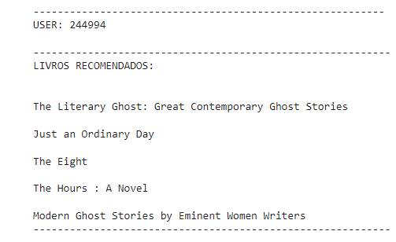

# Book-Recommendation-System
Development of a user-based machine learning to recommend books that user still don't read but users with similar caracteres already read and liked them.

## Technologies
- Google Colaboratoy
- Python
- Scikit Learning
- Numpy
- Pandas

## Dataset
This work needed a dataset linked by a common key and displayed as bellow:
- Ranking dataset
- Books dataset
- Users dataset

download the <a href='http://www2.informatik.uni-freiburg.de/~cziegler/BX/'>datasets</a>

## Results
Given an user ID the system returns the recommended books based on users similarity as shown in the figure bellow:

